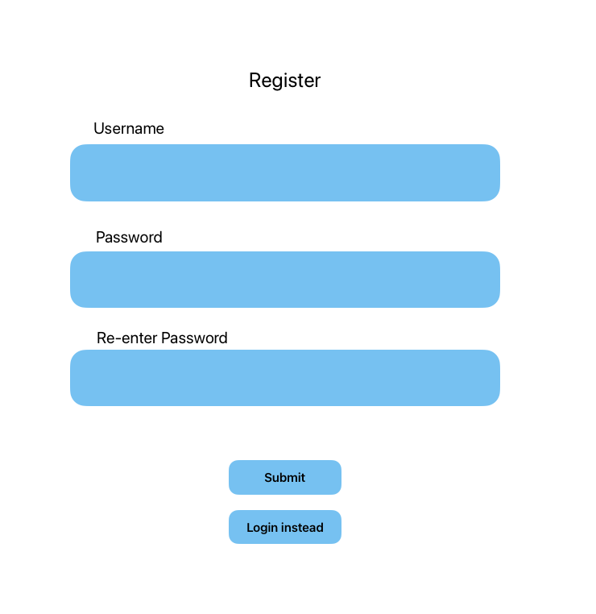
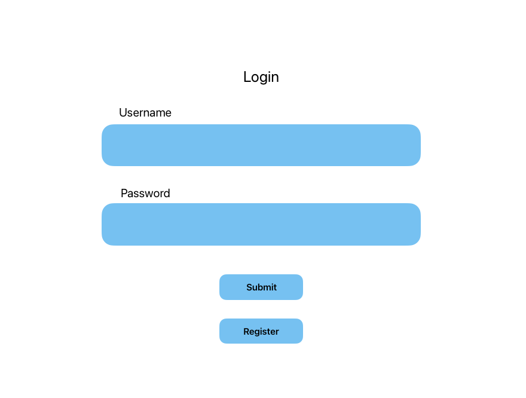
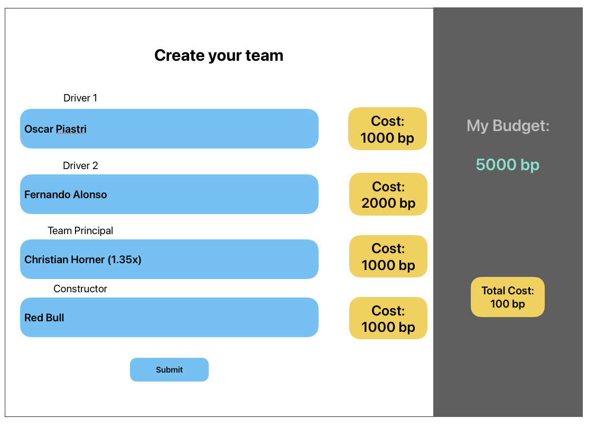
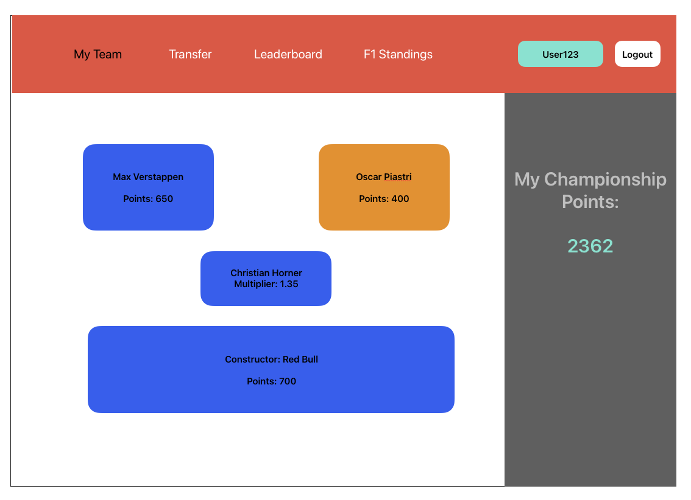
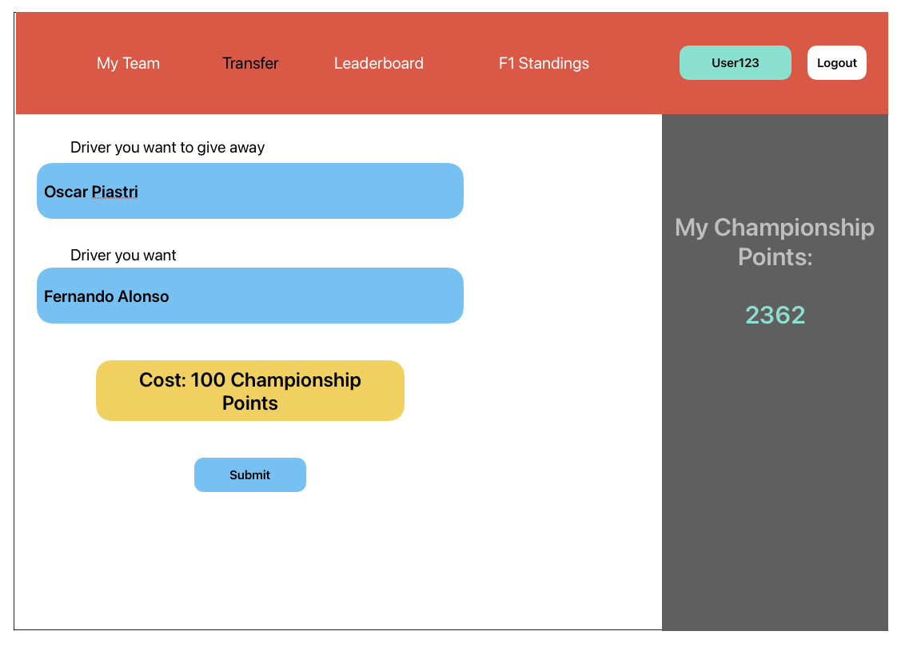
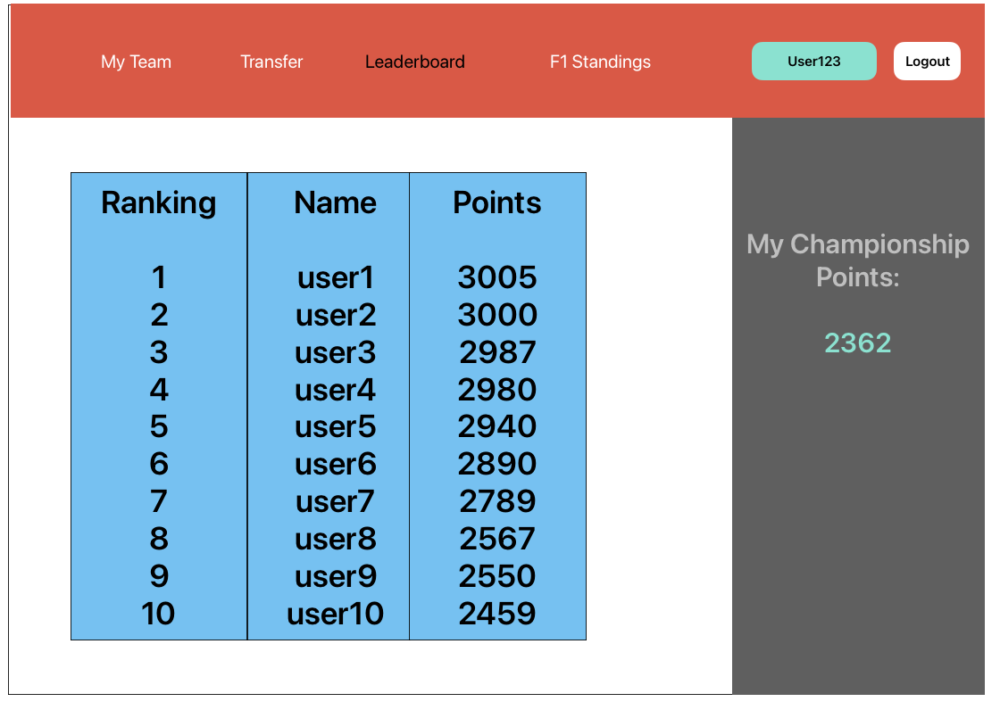
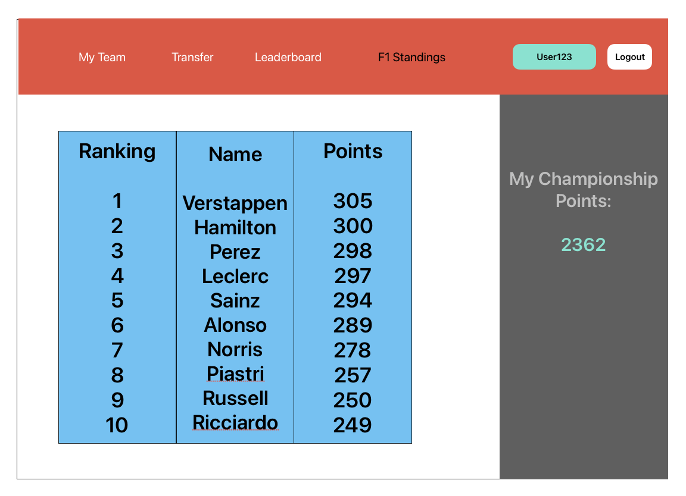
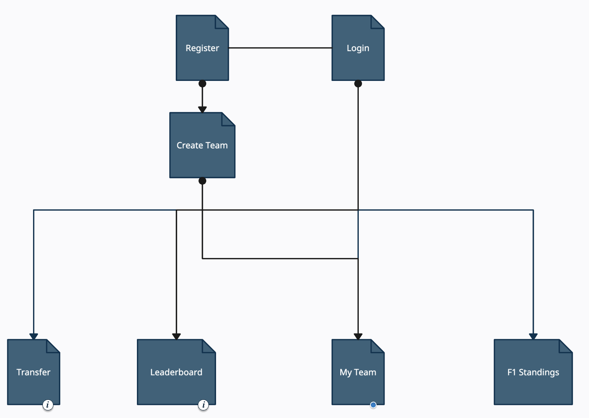

The content below is an example project proposal / requirements document. Replace the text below the lines marked "__TODO__" with details specific to your project. Remove the "TODO" lines.

(__TODO__: your project name)

# F1 Fantasy League

## Overview

(__TODO__: a brief one or two paragraph, high-level description of your project)

This application would be a fantasy league including the current 20 drivers and 10 teams present in the Formula One Season. Users will be able to choose their own constructor (team) and 2 drivers. The choice will be limited by a budget system. 

Once users have their teams set up, they will be able to participate in events linked to real-world races. Once the standings have been updated, the points will be calculated based on the team of choice and the championship points of each driver. The users will also be able to make transfers at the cost of championship points in the fantasy league. 


## Data Model

(__TODO__: a description of your application's data and their relationships to each other) 

The application will store Users, Drivers, Constructors, and Team Principals

*Users can have a maximum of 2 drivers
*Users can have a maximum of 1 Constructor
*Users can have a maximum of 1 Team Principal

(__TODO__: sample documents)

An Example User:

```javascript
{
  username: "f1fan123",
  hash: // a password hash,
  drivers: {driver1: 'Max Verstappen', driver2: 'Sergio Perez'} // an array of references to List documents,
  constructor: 'Red Bull',
  principal: 'Christian Horner',
  points: 2350,
  transfer_penalty: 0
}
```

An Example Driver:

```javascript
{
  name: "Max Verstappen",
  points: 650,
  price: 1000
}
```

An Example Constructor:

```javascript
{
  name: "Red Bull",
  points: 761,
  price: 3000
}
```

An Example Team Principal:

```javascript
{
  name: "Christian Horner",
  price: 1000,
  multiplier: 1.3
}
```


## [Link to Commented First Draft Schema](db.mjs) 

(__TODO__: create a first draft of your Schemas in db.mjs and link to it)
[db.mjs](db.mjs)

## Wireframes

(__TODO__: wireframes for all of the pages on your site; they can be as simple as photos of drawings or you can use a tool like Balsamiq, Omnigraffle, etc.)

/register - page for registering new user



/login - page for logging in existing user



/league/create - page for creating the team



/league/myteam - page for viewing the team



/league/transfer - page for conducting a transfer



/league/leaderboard - page for viewing the leaderboard



/league/standings - page for viewing the current real-life standings



## Site map

(__TODO__: draw out a site map that shows how pages are related to each other)



## User Stories or Use Cases

(__TODO__: write out how your application will be used through [user stories](http://en.wikipedia.org/wiki/User_story#Format) and / or [use cases](https://en.wikipedia.org/wiki/Use_case))

1. as non-registered user, I can register a new account with the site
2. as a user, I can log in to the site
3. as a user, I can create my own team using available options of drivers, principals and constructors with consideration of a set budget
4. as a user, I can view my team
5. as a user, I can view my points
6. as a user, I can view the leaderboard
7. as a user, I can request a transfer, changing either my drivers or my team principal at a cost to my championship points

## Research Topics

(__TODO__: the research topics that you're planning on working on along with their point values... and the total points of research topics listed)

* (3 points) Configuration management
    * I'm going to be using dotenv for configuration management
* (6 points) vue.js
    * Will be using vue.js as the frontend framework
* (1 point) external API
    * Will be using an external API to fetch F1 data 

10 points total out of 10 required points (___TODO__: addtional points will __not__ count for extra credit)


## [Link to Initial Main Project File](app.mjs) 

(__TODO__: create a skeleton Express application with a package.json, app.mjs, views folder, etc. ... and link to your initial app.mjs)

[app.mjs](app.mjs)

[link to lines of code which show how requirements have been met](documentation/requirements_evidence.md)

## Annotations / References Used

(__TODO__: list any tutorials/references/etc. that you've based your code off of)

1. [tutorial on vue.js](https://www.youtube.com/watch?v=YrxBCBibVo0)
2. [tutorial on deploy](https://www.youtube.com/watch?v=W-b9KGwVECs)


